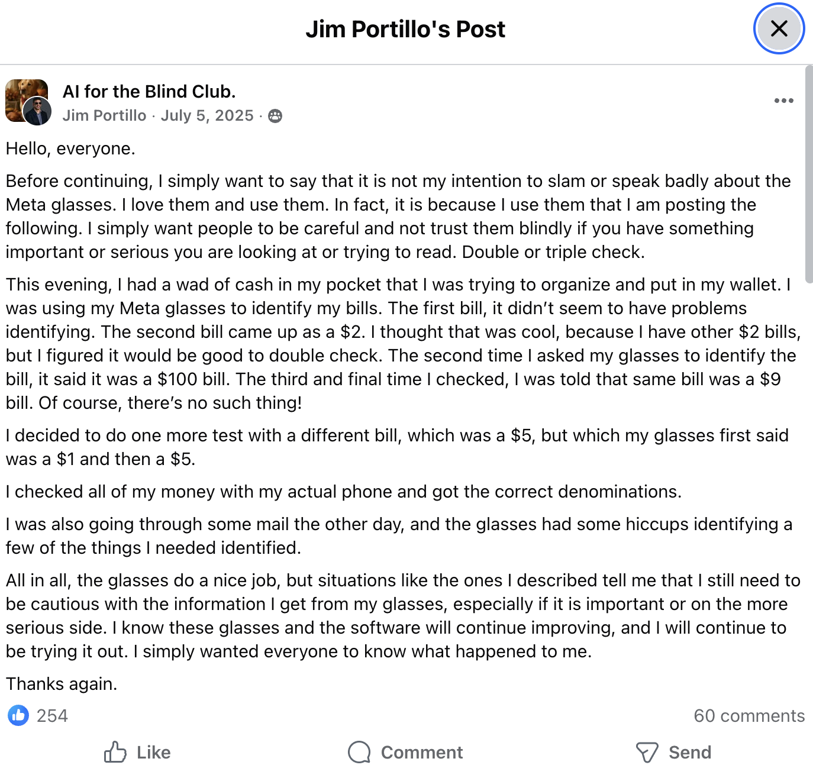


* 3:45-4:35pm: Discussion of Trust and Trustworthiness in Machine Learning Systems
* 4:35-5:25pm: Introduction to BERT



# Discussion on Trust and Trustworthiness Paper

Let's summarize the main points from the paper in small groups.

Make sure you cover the various parameters of trust
* Parameter one: Benevolence.  Social Responsibility, Ethical Behavior, Sustainability, Fairness 
* Parameter two: Integrity.  Standards and Guidelines, Certifications, Government Regulations
* Parameter three: Ability.  Technical correctness, transparency, explainability, reliability, privacy and data 
  governance, technical robustness and safety.

We're revisiting the EchoMinds case study as an entry point into the issues around Trust and Trustworthiness in 
machine learning systems.  Here are some relevant examples from the summer work.

Analyze the following case studies using the framework in the paper.
* [Ashley's anecdote of the positive COVID test](https://olincollege.sharepoint.com/:v:/s/EducateAI/IQC_dRtNEQL3QJj78LLZV-PGAXDSS_DK_NaW4m3Z47qKwyA)
* 
* The EchoMinds app (recall the EchoMinds app returns only notes entered into the app rather than generating content 
  given a prompt).
* https://www.reddit.com/r/Blind/comments/1nqw16e/meta_glasses_total_gamechanger_for_meanyone_else/

Come up with your own case and evaluate it with respect to the parameters of trust.

# Introduction to BERT

We're going to close out our text as data module by learning about how transformer architectures can be used in 
defining text similarity.  We'll show how this capability is at the core of the EchoMinds app, and you'll get a 
chance to implement a series of models that will get increasingly good performance.

I'll talk a little bit about BERT and draw some things on the chalkboard.  You'll also have some time to 