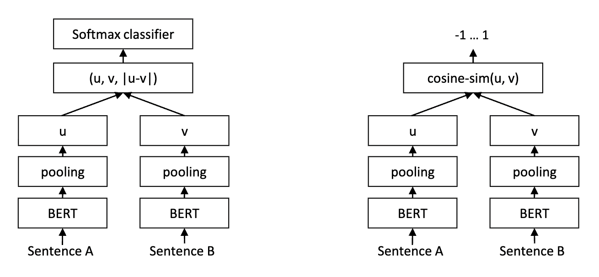


* 3:45-3:55pm: Debrief on previous assignment
* 3:45-4:35pm: SBERT and finetuning
* 4:35-5:25pm: Start assignment on finetuning



# Debrief on previous assignment

How did it go?  What sort of performance did you get?  How did you use the output of the ```[cls]``` token or did 
you use the average of all token embeddings?  Any lingering questions? 

# BERT Limitations

The motivation for SBERT arises from a key limitation of BERT that we bumped up against in the previous assignment 
when trying to use BERT to quantify the similarity of two pieces of text.  Specifically, BERT can be used for 
sentence similarity in two ways.

* Method 1: For a given query, $x_q$, and each potential match $x_i$, feed the ``[CLS]`` $x_q$ ``[SEP]`` $x_i$ ``
[SEP]`` into the BERT model.  BERT will return the likelihood that that $x_q$ and $x_i$ are related.
* Method 2 (what we tried): For a given query, $x_q$, compute an embedding vector $\bm{\phi}(x_q)$.  Do the same for 
  each $x_i$ and then use cosine similarity to match queries to pieces of text.


Suppose it takes $1$ms to run a sentence pair through BERT (method 1).  If you have 1,000 queries and 10,000 
potential matches, how long would it take to match each query to a piece of text?

Suppose it takes $0.5$ms to run a single sentence through BERT.  Further, it takes $1$ microsecond to compute the 
cosine similarity of two embeddings returned by BERT (method 2).  How long would it take to match each query to a 
piece of text (assuming the same numbers of each as in the previous part)?

When is method 2 preferable to method 1?



# SBERT

SBERT ([Sentence-Embeddings using Siamese BERT-Networks](https://arxiv.org/abs/1908.10084)) is a hugely influential paper that forms the basis of many modern approaches for computing similarity between
two pieces of text.  The structure employed in the model is shown in the figure below.



There are two potential architectures for SBERT shown in the figure above.  They both share the same initial steps 
in that you first take a BERT model and encode each sentence pair independently.  The outputs of BERT (obtained 
through a pooling strategy such as averaging over the last hidden states) are either concatenated and fed into a 
either a softmax classifier (which outputs whether the sentences are similar) or the cosine similarity metric (which 
will be close to 1 when the sentences are similar).

## SBERT Training Process


Given what you know about text-based machine learning models, how would you train this model?  What are the design 
decisions you'd have to make in deciding how to train it?  It will probably be more fun to reason through it without 
reading the paper, but you are welcome to consult the paper if you'd like.

We'll discuss how the actual training process works once folks have had a chance to come up with their own ideas.



## SBERT Inference Process


When doing inference (meaning answering which sentences are most similar to each of a set of queries), SBERT can be 
considerably faster than Method 1 for BERT.  Why can SBERT do inference faster?  How would inference work for the 
SBERT model?

We'll discuss the answer to this when folks have had a chance to work through this problem.



# Finetuning SBERT to a new Domain

The idea of finetuning a machine learning model is increasingly important.  In the finetuning process, you take an 
existing machine learning model and train it on a new dataset.  Through this training process, the parameters of the 
model (e.g., the parameters of the neural network) are adapted to fit this new dataset.  Finetuning can be 
understood as a particular approach to the more general idea of [transfer learning](https://en.wikipedia.org/wiki/Transfer_learning) 
where knowledge learned from a task is re-used in order to boost performance on a related task.


In comparison to the alternative of training a model from scratch on a dataset what are some advantages of fine-tuning?  What are some disadvantages?

We'll discuss the answer to this when folks have had a chance to work through this problem.



# Starting Assignment 16

In [assignment 16](../assignments/assignment16/assignment16.markdown), you will be finetuning a sentence transformer 
model on a dataset of your choosing.  For the rest of class, you should look into what datasets are available for this finetuning, how you might generate a dataset yourself,
or what datasets we have provided for finetuning.