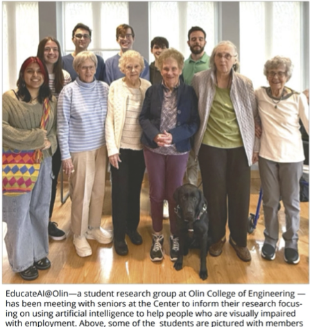
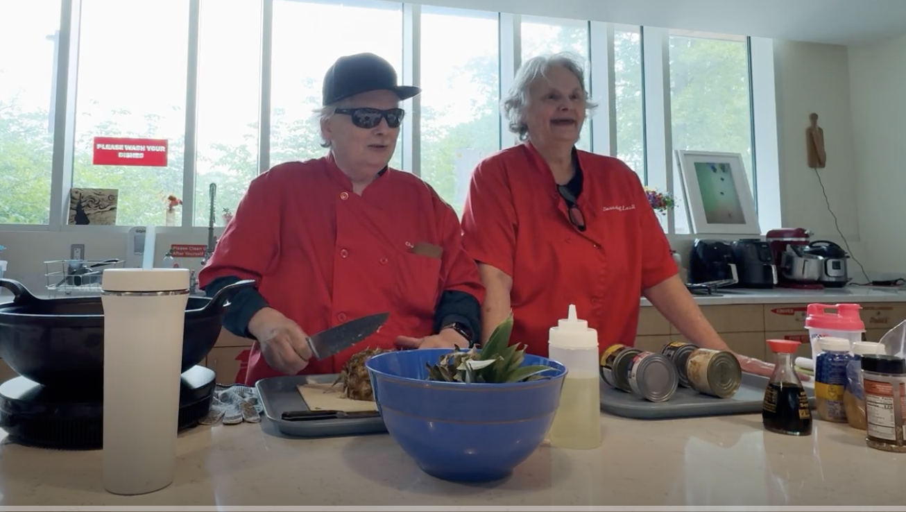
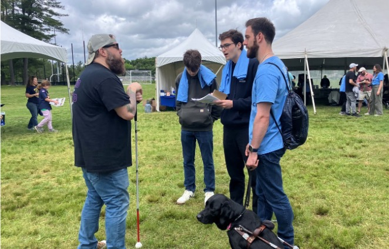
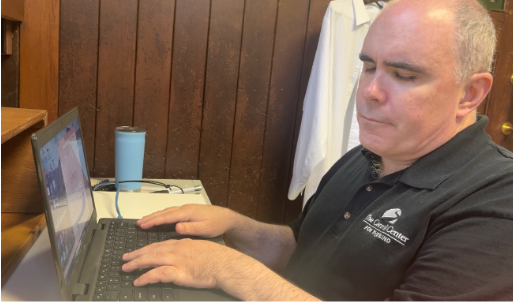
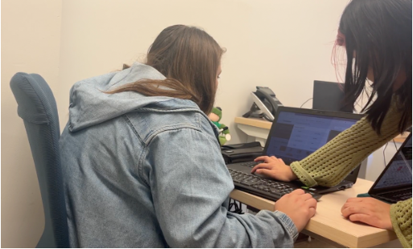

# Learning Objectives


* Understand how human-centered design ideas can play a role in developing machine learning-powered technologies.
* TODO (practice)
* Learn about retrieval metrics for retrival tasks.



# Human-Centered Design in Machine Learning


Before we engage in detail with the design process that led to the creation of the EchoMinds app, we'd like to 
establish some shared concepts around human-centered design.  We know that not everyone has taken CD at Olin, so 
please read this [short article on human-centered design](https://www.uxdesigninstitute.com/blog/what-is-human-centered-design/) and respond to the following prompts.
* How do you think the Human-Centered Design process is different from a classical design process?
* What do you think are the benefits Human-Centered Design?  What are the drawbacks?




How would you apply this design process to a machine learning project (maybe give a specific example or let them
choose)?

[Consider some of these ideas](https://medium.com/design-bootcamp/human-centered-ai-design-process-part-2-empathize-hypothesis-6065db967716)



# The EchoMinds Design Process

We will be using the EchoMinds development case study as a throughline in this course.  Now that you've thought 
about the idea of using human-centered design in the process of creating machine learning technology, we want you to 
engage with the specifics of the EchoMinds design process.  As you engage, we invite you to consider what you liked 
about what the team did, and, potentially, what you would have done differently.

These were the major activities and phases of the team's design process.

## Activity 1: Orientation
See 

  * Orientation to the project
  * Introduction to key concepts in disability justice
  * [Exploring with the Seeing AI app](supplementary_files/seeing_ai_activity.pptx)

[Practicing fieldwork[fieldworktips](supplementary_files/fieldworktips.pdf)] (tips)

  * [Blindness education at the Carroll Center](https://olincollege.sharepoint.com/:v:/s/EducateAI/IQDVehDbmW6qRK9aO41k3e31Aar8-5fweQDj-vmOZRyYIFo?nav=eyJyZWZlcnJhbEluZm8iOnsicmVmZXJyYWxBcHAiOiJTdHJlYW1XZWJBcHAiLCJyZWZlcnJhbFZpZXciOiJTaGFyZURpYWxvZy1MaW5rIiwicmVmZXJyYWxBcHBQbGF0Zm9ybSI6IldlYiIsInJlZmVycmFsTW9kZSI6InZpZXcifX0%3D&e=7qMB27)
  * Overview of access technology for people who are blind (with Brian Switzer of the Carroll Center)
  * 

Walk for Independence**

Interviewing
[Interview tips](supplementary_files/interview_tips.pptx)

Secondary source research on employment for people who are blind.
* [Working Blind series](https://www.youtube.com/watch?v=06CzR7ebX_Y)
* [Blind and Disabled - My Job Search/Employment Experience](https://www.youtube.com/watch?v=-Ik6tmtCuHQ)
* [Cayla: Job Hunting while legally blind (part 2)](https://www.youtube.com/watch?v=tnoT04ea-XE)
* [Where The Blind Work: Remote Work](https://www.youtube.com/watch?v=5vYhrhNkaXw)

[Design justice](supplementary_files/designjustice.pptx)

## Activity 2: Initial Fieldwork

(example fieldwork schedule)

(volunteering)

## Activity 3: Ideation

## Activity 4: Design Activities

* [AI resume builder design activity](supplementary_files/AI_resume_builder.docx)
* [Voice memo roleplay](supplementary_files/voice_memo_roleplay.docx)
* [BlurbBot](supplementary_files/BlurbBot.docx)

## Activity 5: Prototyping

## Activity 6: Internal Testing

* Internal Testing Activities (Preliminary Testing.docx has the one that Bela created)

## Activity 7: Notetaking Survey

## Activity 8: Refining Prototype

<iframe width="560" height="315" src="https://www.youtube.com/embed/VP8x9vU41O8?si=gptcNdATaxBannOu" title="YouTube video player" frameborder="0" allow="accelerometer; autoplay; clipboard-write; encrypted-media; gyroscope; picture-in-picture; web-share" referrerpolicy="strict-origin-when-cross-origin" allowfullscreen></iframe>

## Activity 9: Testing With Community Partners

* Brainstorming for testing.docx (has the procedure)
* Testing 3 Rounds (Tiramisu with Oliners, CCB, and Jerry and Aaron)


Please categorize the major activities of the summer team with respect to the HCD steps of observation, ideation, rapid 
prototyping, user feedback, iteration, and implementation.  For each activity, comment on how the particular 
activity fit with the chosen stage of the design process.  For example, did an activity do a good job advancing the 
design process?  What did you like?  What would you change?  What activities (or changes thereto) do you think would 
have made the design process stronger?



# Assessing Machine Learning Systems (Beyond Metrics)


Come up with a plan for evaluating the EchoMinds app.  You may consider evaluating the usage of the system itself, 
testing the underlying machine learning system (TODO define what this is) or some combination.  You may also find it 
useful to consider [qualitative versus quantitative methods of assessment](https://medium.com/@sujathamudadla1213/difference-between-quantitative-and-qualitative-evaluation-of-models-127d7e51da56)
or [alternative dimensions of that govern AI system success](https://medium.com/design-bootcamp/introducing-the-ai-ux-self-assessment-questionnaire-99b67eadac4a) (besides accuracy)

